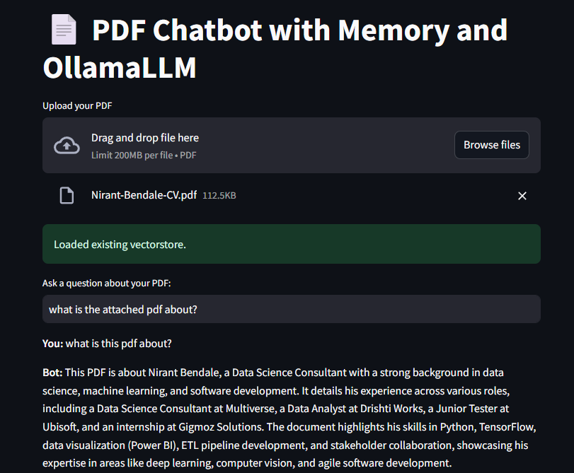

# LangChain PDF Chatbot with FAISS and Ollama

## Overview
Built an intelligent chatbot that leverages Ollama’s Gemma3 large language model with LangChain for orchestration and FAISS for vector similarity search. The system loads a PDF document, splits it into over 1000 semantic chunks using HuggingFace embeddings, and indexes them in FAISS to enable fast and accurate retrieval. The chatbot maintains chat history and vectorstore persistently, ensuring contextual conversation continuity across sessions.

## Features

- PDF Document Ingestion: Loads and splits PDF documents into manageable chunks for semantic processing.
- Embedding-Based Vector Store: Uses HuggingFace sentence-transformer embeddings and FAISS for fast and efficient semantic search over document chunks.
- LangChain RetrievalQA: Combines vector retrieval with the Ollama LLM (Gemma3 model) to provide accurate, context-aware answers from the PDF content.
- Persistent Chat History: Saves user queries and model responses locally to maintain conversation context across sessions.
- Local Vector Store Persistence: Saves and loads the FAISS vector index to avoid reprocessing PDFs on every startup.
- Streamlit Web Interface: User-friendly chat UI for interactive document-based question answering.

## Technologies Used
- SentenceTransformer (all-MiniLM-L6-v2)
- Ollama LLM (Gemma3)
- Langchain framework for vectorstore and retrieval-based QA
- FAISS for vector similarity search
- PyMuPDF for PDF loading and text extraction
- Streamlit for UI

## Usage
1. Upload a PDF document relevant to the diagnostics.
2. Interact with the chatbot to ask troubleshooting questions.
3. Chat history and documents persist during the session for context-aware responses.

---

## Author
Rishi Kulkarni

---

